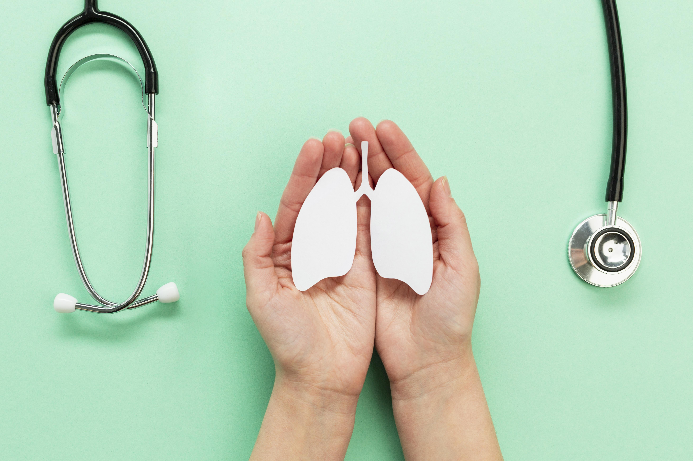
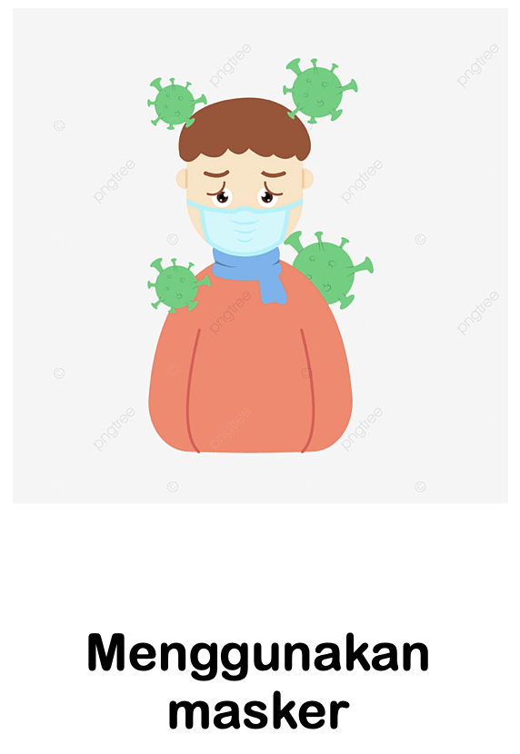
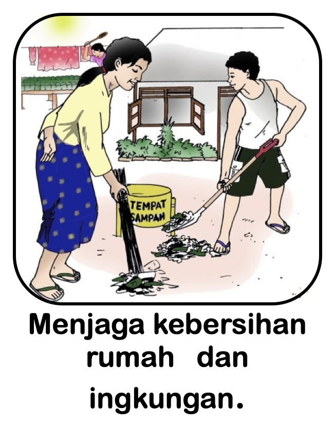
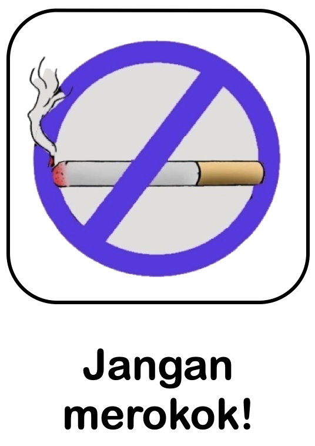

# Pencegahan Penularan

Tuberkulosis (TB) adalah suatu penyakit menular yang disebabkan oleh bakteri Mycobacterium tuberculosis, yang dapat menyerang berbagai organ, terutama paru-paru. TB umumnya ditularkan melalui udara. Ketika penderita TB aktif memercikkan lendir atau dahak saat batuk atau bersin, kuman TB akan ikut keluar melalui lender/dahak tersebut, dan terbawa udara. Kemudian kuman TB akan masuk ke tubuh orang lain melalui udara yang dihirupnya. Pencegahan penularan TB termasuk menerapkan perilaku hidup bersih dan sehat, etika berbatuk, menjaga rumah tetap sehat, meningkatan daya tahan tubuh, pengobatan penyakit penyerta TB, dan pencegahan dan pengendalian infeksi TB.

### Penularan TB

Cara penularan TB dijelaskan secara rinci dalam Keputusan Menteri Kesehatan Republik Indonesia No.364/MENKES/SK/V/2009 tentang pedoman penanggulangan TB. TB hanya dapat ditularkan oleh penderita dengan status Bakteri Tahan Asam (BTA) positif. Penularan terjadi saat penderita batuk maupun bersin. Setiap penderita batuk, maka 3.000 percikan dahak akan keluar dan menyebar melalui udara. Percikan akan bertahan di dalam ruangan selama beberapa jam dalam kondisi lingkungan yang gelap serta lembab. Sebaliknya, jumlah percikan dahak akan berkurang dalam ruangan dengan kondisi ventilasi yang baik. Kuman TB akan terbunuh saat terkena cahaya matahari secara langsung. Seseorang dapat tertular apabila berada di dalam ruangan dengan kadar kuman TB yang tinggi dan dalam jangka waktu yang lama (Kemenkes, 2009).

Pengaruh penularan TB ke orang lain bergantung pada jumlah bakteri pada percikan dahak di udara dan lamanya paparan. Kontak dekat dengan penderita TB rentan tertular dan menjadi sakit dalam tahun pertama setelah terpapar. Kontak dapat terjadi di rumah, tempat kerja, dan daerah kumuh (Churchyard et al., 2017).

### Pencegahan

* a) Membudayakan perilaku hidup bersih dan sehat.
* b) Membudayakan perilaku etika berbatuk.
* c) Melakukan pemeliharaan dan perbaikan kualitas perumahan dan lingkungannya sesuai dengan standar rumah sehat.
* d) Peningkatan daya tahan tubuh.
* e) Penanganan penyakit penyerta TB.
* f) Penerapan pencegahan dan pengendalian infeksi TB di dalam dan di luar fasilitas pelayanan kesehatan.

(Sumber: Kemenkes,2018)

### Perilaku Hidup Bersih dan Sehat (PHBS) di rumah tangga

PHBS adalah semua perilaku kesehatan yang dilakukan atas kesadaran sehingga anggota keluarga atau keluarga dapat menolong dirinya sendiri di bidang kesehatan dan berperan aktif dalam kegiatan-kegiatan kesehatan di masyarakat. PHBS di rumah tangga adalah upaya untuk memberdayakan anggota rumah tangga agar tahu, mau, dan mampu melaksanakan perilaku hidup bersih dan sehat serta berperan aktif dalam gerakan kesehatan di masyarakat. PHBS di rumah tangga dilakukan untuk mencapai rumah tangga sehat.
Rumah tangga sehat adalah rumah tangga yang melakukan 10 PHBS di rumah tangga yaitu :
1. Persalinan ditolong oleh tenaga kesehatan.
2. Memberi bayi ASI eksklusif.
3. Menimbang bayi dan balita.
4. Menggunakan air bersih.
5. Mencuci tangan dengan air bersih dan sabun.
6. Menggunakan jamban sehat.
7. Memberantas jentik di rumah.
8. Makan buah dan sayur setiap hari.
9. Melakukan aktifitas fisik setiap hari.
10. Tidak merokok di dalam rumah.

